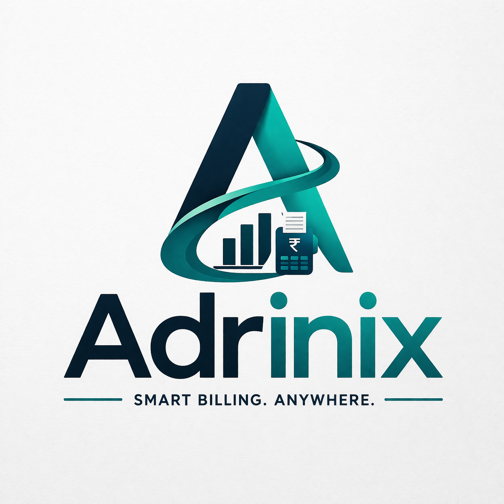

# Adrinix - Premium Global Invoicing & Billing Platform

Adrinix is a high-fidelity, multi-tenant invoicing solution designed for modern businesses. Built with a sleek, dark-themed aesthetic and a mobile-first philosophy, it enables entrepreneurs to manage multiple companies, clients, and catalogs from a single unified dashboard.

 (Replace with an actual screenshot if available)

## 🚀 Key Features

- **Multi-Company Management**: Manage several businesses (tenants) under one account with isolated data and custom branding.
- **Mobile Responsive**: Fully optimized for phones, tablets, and desktops using a slide-out navigation system.
- **Smart Invoicing**: Live-calculated invoices with support for tax-inclusive/exclusive pricing and automatic PDF generation.
- **Global Settings**: Dynamic regional configurations for currency symbols, number formatting (locales), and tax profiles.
- **Unified Dashboard**: Real-time business metrics including revenue tracking, awaiting payments, and client activity charts.
- **Secure Architecture**: JWT-based authentication with a secure PHP/MySQL backend.

## 🛠️ Tech Stack

- **Frontend**:
  - React 18+ & TypeScript
  - Vite (Build Tool)
  - Zustand (State Management)
  - Lucide React (Iconography)
  - CSS Modules (Premium Styling)
  - React PDF (Invoice Generation)
- **Backend**:
  - PHP 7.4+ (API Layer)
  - MySQL 5.7+ (Relational Database)
  - JWT (Authentication)

## 📦 Getting Started

### Prerequisites

- Node.js (v18+)
- PHP Server (Apache/Nginx)
- MySQL Database

### Frontend Setup

1. Navigate to the frontend directory:
   ```bash
   cd GlobalInvoiceApp
   ```
2. Install dependencies:
   ```bash
   npm install
   ```
3. Run in development mode:
   ```bash
   npm run dev
   ```
4. Build for production:
   ```bash
   npm run build
   ```

### Backend Setup

1. Import the database schema:
   - Execute the SQL found in `database.sql` on your MySQL server.
2. Configure the database:
   - Edit `api/db.php` with your database credentials.
3. Hosting:
   - Ensure the `api/` folder is accessible from your server and that `AllowOverride All` is enabled for `.htaccess` routing (if using Apache).

## 🗄️ Database Structure

Adrinix uses a robust relational schema:
- `users`: Core account data.
- `companies`: Business profiles linked to users.
- `clients`: Customer database scoped by company.
- `products`: Service/Product catalog scoped by company.
- `invoices`: Billing records with full line-item history.
- `tax_profiles`: Custom tax rules and rates.

## 📄 License

This project is licensed for private business use by AdhriTech.

---
*Built with ❤️ by AdhriTech Tools & Antigravity*
